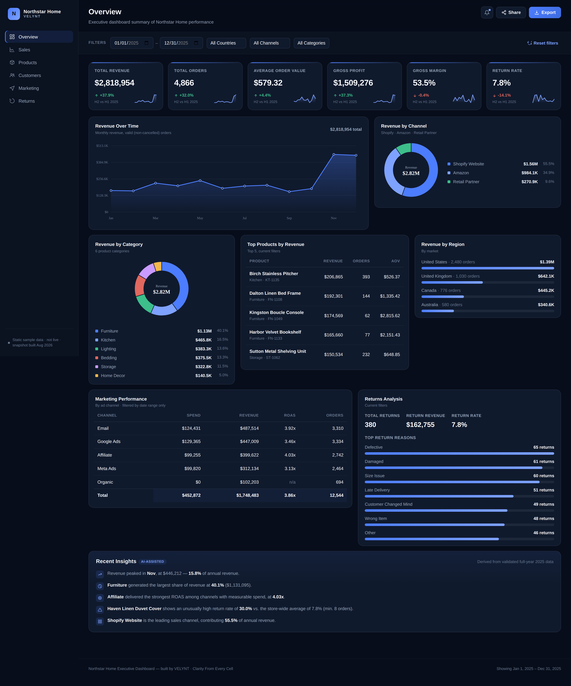
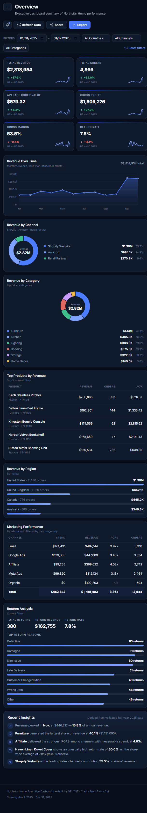

# Northstar Home — Executive Business Intelligence Dashboard

**Live demo:** https://northstardashboard.netlify.app/

## Project Status

Fictional portfolio project, built to demonstrate an end-to-end data-to-dashboard workflow. Not a real client project.

## Screenshots




## Overview

Northstar Home is a single-page executive dashboard that pulls live data from a connected Google Sheet. It covers KPIs, trend charts, filtering, and page-level breakdowns across sales, products, customers, marketing, and returns.

## Key Features

- Live data fetched directly from Google Sheets on load. No backend or API key. Uses Google's public gviz endpoint against a sheet shared as "Anyone with the link – Viewer."
- Manual refresh button that re-fetches current sheet data without reloading the page.
- Date range, country, channel, and category filters that recompute every KPI and chart.
- Six dashboard views: Overview, Sales, Products, Customers, Marketing, Returns.
- Hand-built SVG charts: sparklines, an area/line chart with tooltips, a donut chart, horizontal bar lists. No charting library.
- Export via the browser's print dialog, backed by a dedicated print stylesheet.
- Share button that copies a summary of the current view and date range to the clipboard.
- Built-in data-quality notice surfacing known reconciliation issues in the source dataset (see below).
- Responsive layout with a collapsible mobile navigation panel.
- Loading and error states around the data fetch, with a retry action.

## Data Workflow

Raw business data across five areas (Sales, Returns, Marketing, Products, Customers) was audited, cleaned, and normalized before being loaded into the Google Sheet that powers this dashboard live.

## Data Quality Notes

A subset of rows didn't fully reconcile against their expected formulas during validation. Some Sales rows, for example, have a Total Amount that doesn't exactly match Qty × Price − Discount + Shipping + Tax. The dashboard treats the audited Total Amount and Cost fields as the source of truth rather than recalculating them, and surfaces the known discrepancies through an in-app notice.

## Technology

Vanilla JavaScript, HTML, and CSS. No frameworks, no build step, no external charting library. Data is fetched client-side via Google Sheets' public gviz endpoint.

## Architecture

Single-page application. On load, app.js fetches all five sheet tabs in parallel, maps spreadsheet columns to internal field names, coerces types (including Google's Date(Y,M,D) cell format), and builds the derived data structures each page renders from. Filter and page state drive a single re-render cycle. All charts are inline SVG rendered directly from the data.

## Project Structure

```
northstar-home/
├── index.html      — markup and layout shell
├── style.css       — styling, responsive breakpoints, and a print stylesheet
├── app.js          — data fetching, KPI logic, chart rendering, filtering, page routing
└── README.md
```

## VELYNT Context

Built to demonstrate the kind of data-to-dashboard work done under VELYNT, a dashboard studio that turns spreadsheet data into decision-ready dashboards.
